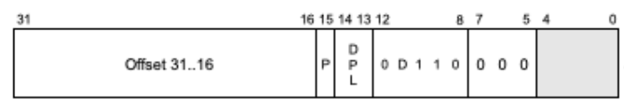
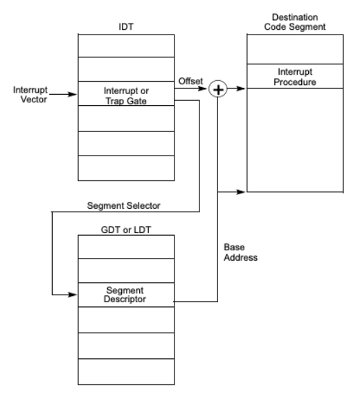
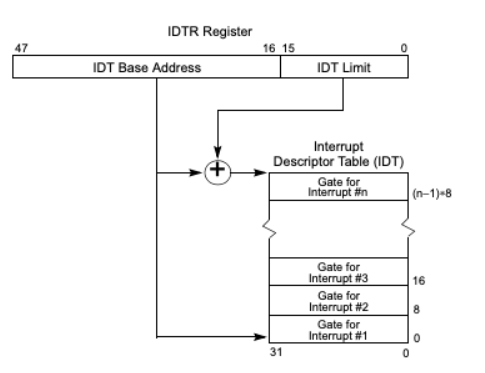

# Interrupt Descriptor Table

In this article we look at the Interrupt Descriptor Table and how the processor uses it to handle errors.

Interrupts are used to indicate that a condition exists somewhere in the system that requires the immediate attention of the processor. This results in a forced transfer of execution to a software function that handles the interrupt. The processor has a number of architecturally defined interrupts each with a unique identifier number called a vector number. The processor uses the vector number as an index into the interrupt descriptor table. The IDT can only have 256 entries which means that the range of vector numbers is `0` and `255`. The vector numbers `0` to `31` are reserved for handling processor interrupts. The rest, `32` to `255` vector numbers, can be used for user defined interrupts. Note that an interrupt vector number `0` is associated with index `0` of the interrupt descriptor table.

The interrupt descriptor table has gate descriptors as entries. A gate descriptor defines where to find the handler procedure in memory and the privilege level. It has the format below.



**Offset**, this is the offset to the procedure’s entry point. Think of it as the starting address of the procedure in memory.<br/>
**P**, the segment present flag.<br/>
**DPL**, descriptor privilege level.<br/>
**D**, the size of the gate; 1  =  32 bits, 0 = 16 bits.

## Handling An Interrupt

When an interrupt occurs, the CPU uses the vector number as an index into the interrupt descriptor table. It then uses the segment selector and offset in the gate descriptor to locate the handling procedure in memory. Then the CPU transfers control to the handling procedure.



## Loading The Interrupt Descriptor Table

The `LIDT` instruction is used to set the content of the `IDTR` register with the base address and limit of the interrupt descriptor table.



Create an assembly file `idt.s` and write the following code to load our idt table.

> See code in [`/descriptors/idt/idt.s`](../descriptors/idt/idt.s)

Marking the `idt_flush` function as global allows us to call it from our C code which we are yet to write. We’ll pass the interrupt descriptor pointer to `idt_flush`, we are accessing that value in assembly through `[esp + 4]`. The `lidt [eax]` instruction, loads the values at that memory address into the idtr register and finally we return from the function.

## Creating The Interrupt Descriptor Table

We’ll create the interrupt descriptor table in C. Create a file `interrupt_table.h` and write the following code.

> Code here - [`/descriptors/idt/interrupt_table.h`](../descriptors/idt/interrupt_table.h)

Then create a file `interrupt_table.c` and write the code below.

> Code here - [`/descriptors/idt/interrupt_table.c`](../descriptors/idt/interrupt_table.c)

Then create an assembly file `interrupt.s` and write the following code.

> Code here - [`/descriptors/idt/interrupt.s`](../descriptors/idt/interrupt.s)

This assembly files calls the `isr_handler` function which we have not created yet.  Create `isr.h` and write the code below.

> Code here - [`/descriptors/idt/isr.h`](../descriptors/idt/isr.h)

Then create isr.c and write:

> Code here - [/descriptors/idt/isr.c](../descriptors/idt/isr.c)

Finally add the following code in your `main.c`

```c
#include "../common/types.h"
#include "../drivers/monitor/monitor.h"
#include "../descriptors/gdt/global_desc_table.h"

int main(void* mboot_ptr) {
   init_descriptor_tables();

   monitor_clear();
   monitor_write("Hello World\n");

   asm volatile("int $0x3");
   asm volatile("int $0x4");
}
```

After running your os, you should have the following printed on your screen.


