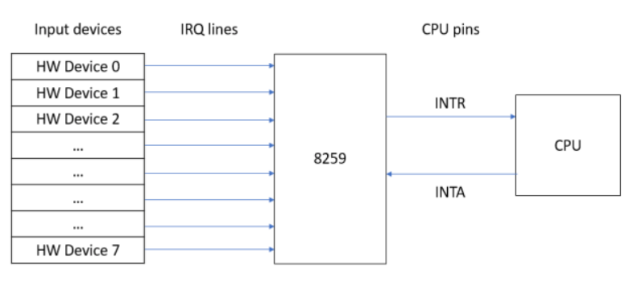

# Interrupt Requests

In the last article we learnt how the CPU uses interrupts to handle exceptions. In this article we’re going to learn about interrupt requests and how they are used to communicate with external devices.

All external devices are connected to the programmable interrupt controller, which is then connected to the CPU. The programmable interrupt controller has 15 interrupt request lines. Each line is connected to an external device. For example the programmable interrupt timer is connected to the interrupt request line 0 (IRQ 0) and the keyboard is connected to the interrupt request line 1 (IRQ 1). In the diagram below, the programmable interrupt controller is the 8259 chip.



When an interrupt request line is activated, the PIC generates an interrupt request. By default interrupt request lines `0..7` generates interrupt requests with vector numbers `8` to `15` and `IRQ 8..15` generate interrupt requests with vector numbers `0x70..0x77`. In the previous article we mentioned that the interrupt vector numbers `0..31` are reserved for the CPU, so there’s an obvious collision here with interrupt requests lines that generate interrupts with vector numbers `0..7`. To solve this we have to remap the programmable interrupt controller so that for interrupt request lines 0..15 it generates interrupt vector numbers `32..47`.

Write the code below in `interrupt_table.c`, it will do the remapping.

```c
write_byte_to_port(0x20, 0x11);
write_byte_to_port(0xA0, 0x11); 
write_byte_to_port(0x21, 0x20);  
write_byte_to_port(0xA1, 0x28);  

write_byte_to_port(0x21, 0x04);
write_byte_to_port(0xA1, 0x02);
write_byte_to_port(0x21, 0x01);
write_byte_to_port(0xA1, 0x01);
write_byte_to_port(0x21, 0x0);
write_byte_to_port(0xA1, 0x0);

asm volatile("sti");
```

Next we need to define assembly procedures that will transfer control to our C code when an interrupt happens.

```masm
%macro IRQ 2
 global irq%1
 irq%1:
   cli
   push byte 0
   push byte %2
   jmp irq_common_stub
%endmacro

IRQ 0,  32
IRQ 1,  33
IRQ 2,  34
IRQ 3,  35
IRQ 4,  36
IRQ 5,  37
IRQ 6,  38
IRQ 7,  39
IRQ 8,  40
IRQ 9,  41
IRQ 10, 42
IRQ 11, 43
IRQ 12, 44
IRQ 13, 45
IRQ 14, 46
IRQ 15, 47
```

The we defined the `irq_handler` procedure

```
; In isr.c
[EXTERN irq_handler]

; This is our common IRQ stub. It saves the processor state, sets
; up for kernel mode segments, calls the C-level fault handler,
; and finally restores the stack frame.
irq_common_stub:
  pusha                    ; Pushes edi,esi,ebp,esp,ebx,edx,ecx,eax

  mov ax, ds               ; Lower 16-bits of eax = ds.
  push eax                 ; save the data segment descriptor

  mov ax, 0x10  ; load the kernel data segment descriptor
  mov ds, ax
  mov es, ax
  mov fs, ax
  mov gs, ax

  call irq_handler

  pop ebx        ; reload the original data segment descriptor
  mov ds, bx
  mov es, bx
  mov fs, bx
  mov gs, bx

  popa                     ; Pops edi,esi,ebp...
  add esp, 8     ; Cleans up the pushed error code and pushed ISR number
  sti
  iret           ; pops 5 things at once: CS, EIP, EFLAGS, SS, and ESP
```

With most of the assembly out of the way, now let’s handle interrupt requests. Write the following in `interrupt_table.h`.

```c
extern void irq0();
extern void irq1();
extern void irq2();
extern void irq3();
extern void irq4();
extern void irq5();
extern void irq6();
extern void irq7();
extern void irq8();
extern void irq9();
extern void irq10();
extern void irq11();
extern void irq12();
extern void irq13();
extern void irq14();
extern void irq15();
```

Next we add these routines into the interrupt descriptor table(IDT).

```
idt_set_gate(32, (u32int)irq0, 0x08, 0x8E);
idt_set_gate(33, (u32int)irq1, 0x08, 0x8E);
idt_set_gate(34, (u32int)irq2, 0x08, 0x8E);
idt_set_gate(35, (u32int)irq3, 0x08, 0x8E);
idt_set_gate(36, (u32int)irq4, 0x08, 0x8E);
idt_set_gate(37, (u32int)irq5, 0x08, 0x8E);
idt_set_gate(38, (u32int)irq6, 0x08, 0x8E);
idt_set_gate(39, (u32int)irq7, 0x08, 0x8E);
idt_set_gate(40, (u32int)irq8, 0x08, 0x8E);
idt_set_gate(41, (u32int)irq9, 0x08, 0x8E);
idt_set_gate(42, (u32int)irq10, 0x08, 0x8E);
idt_set_gate(43, (u32int)irq11, 0x08, 0x8E);
idt_set_gate(44, (u32int)irq12, 0x08, 0x8E);
idt_set_gate(45, (u32int)irq13, 0x08, 0x8E);
idt_set_gate(46, (u32int)irq14, 0x08, 0x8E);
idt_set_gate(47, (u32int)irq15, 0x08, 0x8E);
```

Write the following in `isr.h`.

```c
typedef void (*isr_t)(registers_t);
void register_interrupt_handler(u8int entry, isr_t handler);
```

And finally, we write some code to handle the interrupts.

```c
isr_t interrupt_handlers[256];

void register_interrupt_handler(u8int entry, isr_t handler) {
   interrupt_handlers[entry] = handler;
}

void irq_handler(registers_t regs)
{
   if (regs.int_no >= 40)
   {
       write_byte_to_port(0xA0, 0x20);
   }
   write_byte_to_port(0x20, 0x20);

   if (0 != interrupt_handlers[regs.int_no])
   {
       isr_t handler = interrupt_handlers[regs.int_no];
       handler(regs);
   }
}
```
